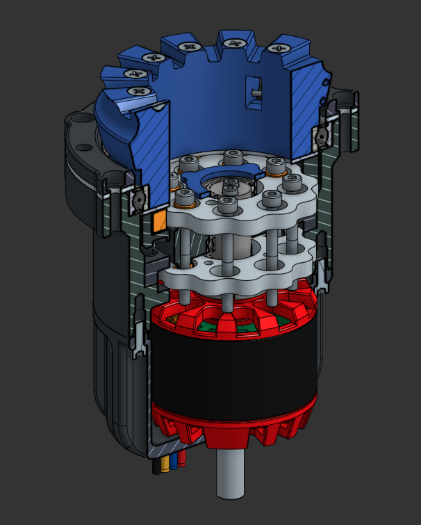

The Cycloidal drive has been fully manufactured and assembled. It contains brass bushings as bearings and stainless steel lasercut cycloids.
Testing proved this drive is not up to the task. The vibrations make it completely unsuited for this application.

{/* truncate */}

We decided to pivot to the more conventional wolfrom drive instead of the "differential cycloidal drive".
Since we have more experience using these collectively, it is a suitable fallback.

  <video controls muted style={{width: '50%', maxWidth: '30%', borderRadius: '8px'}}>
    <source src="/blog/cycloidal_drive.mp4" type="video/mp4" />
  </video>
  <video controls muted style={{width: '50%', maxWidth: '30%', borderRadius: '8px'}}>
    <source src="/blog/a_new_hope.mp4" type="video/mp4" />
  </video>

