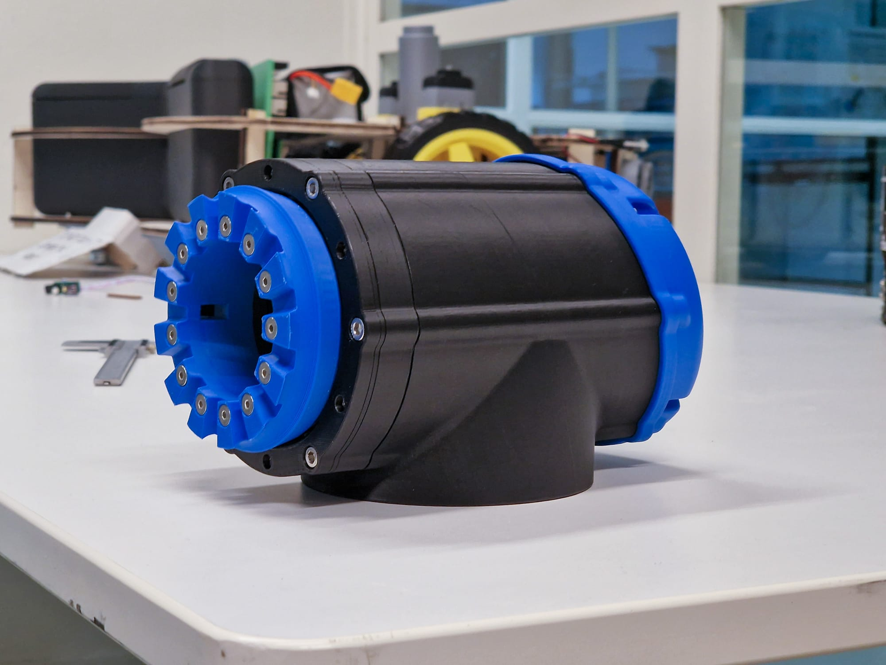

This week we fully assembled our first R120 Joint. The new Wolfrom drive proved to be the better choice as opposed to the cycloidal drive.
This drive runs way smoother. The flaw seems to have been in the design of the differential cycloidal drive.
There are countless examples of that drive running smoothly, but the reduction ratios in those cases were also significantly lower (10:1 > i > 50:1).
Our speculation is that the vibration only appears for larger ratios like our drive, which had i = 189:1.

<video controls style={{width: '100%', borderRadius: '8px', margin: '16px 0'}}>
  <source src="/blog/joint_vid.mp4" type="video/mp4" />
</video>