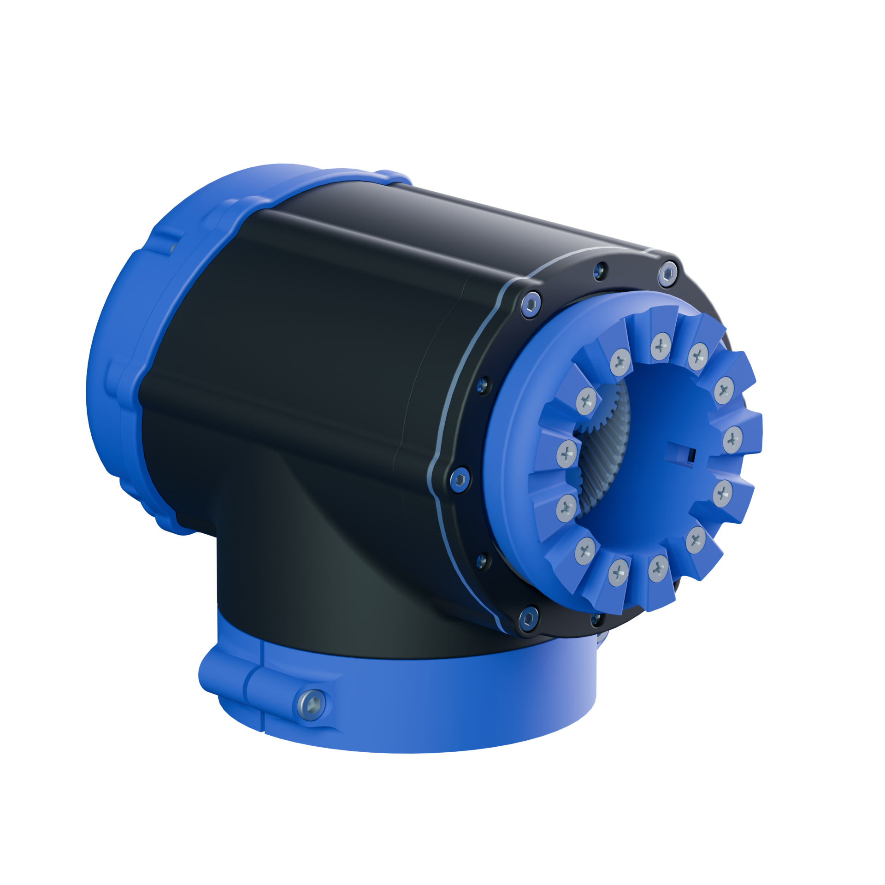
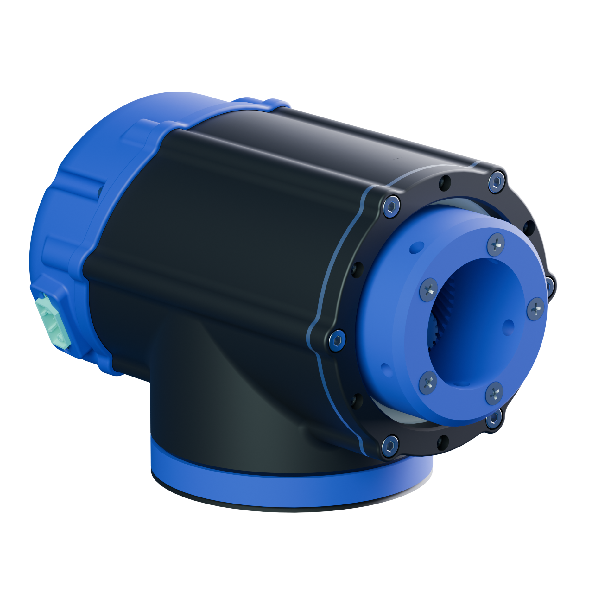

# Joints

Current Joint Library

  <a href="joints/joint-revolute-l.html" style="text-decoration:none;">
    

      

        Revolute L
        revolute
      

      

        
        
120mm OD revolute joint.

      

    

  </a>

  <a href="joints/joint-revolute-m.html" style="text-decoration:none;">
    

      

        Revolute M
        revolute
      

      

        
        
120mm OD revolute joint.

      

    

  </a>

